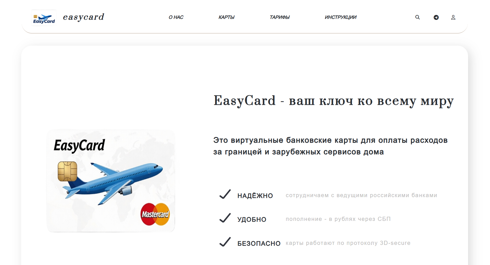
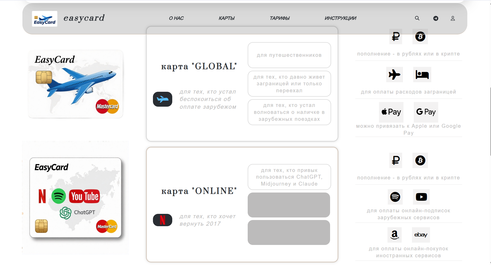
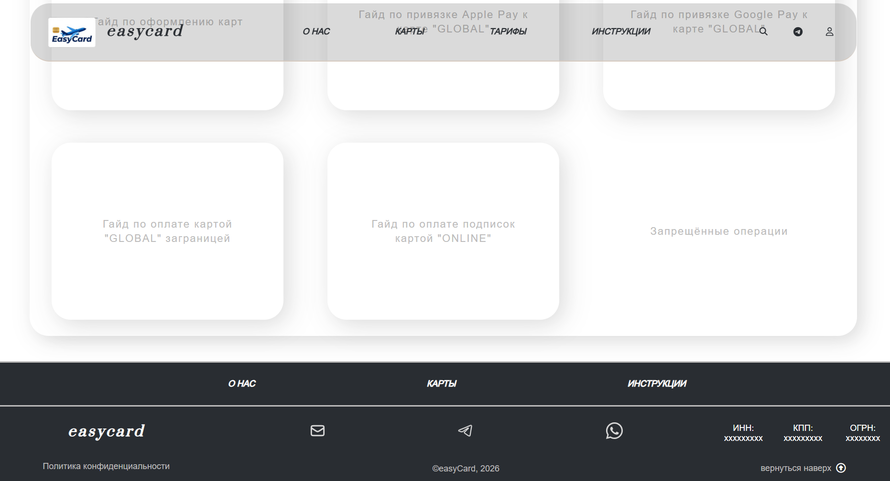
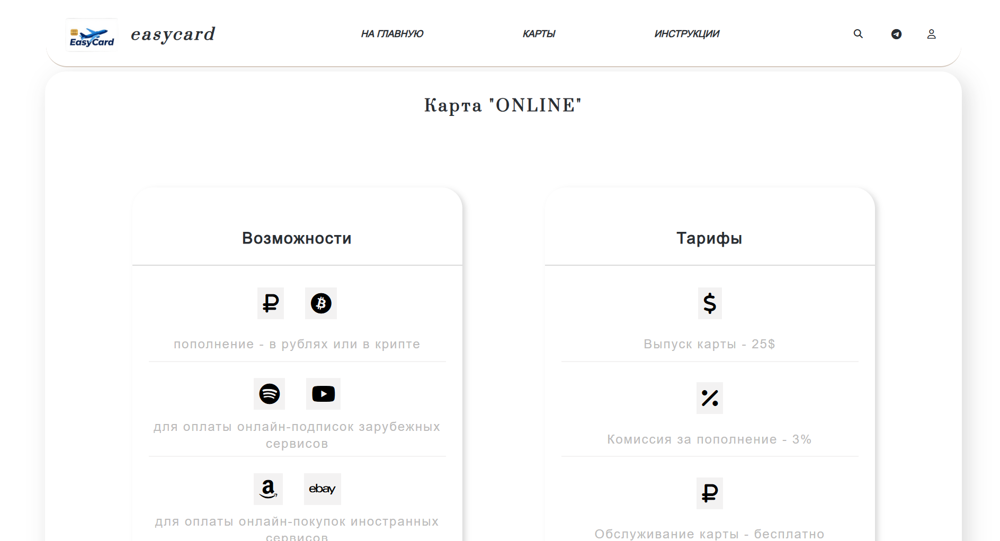
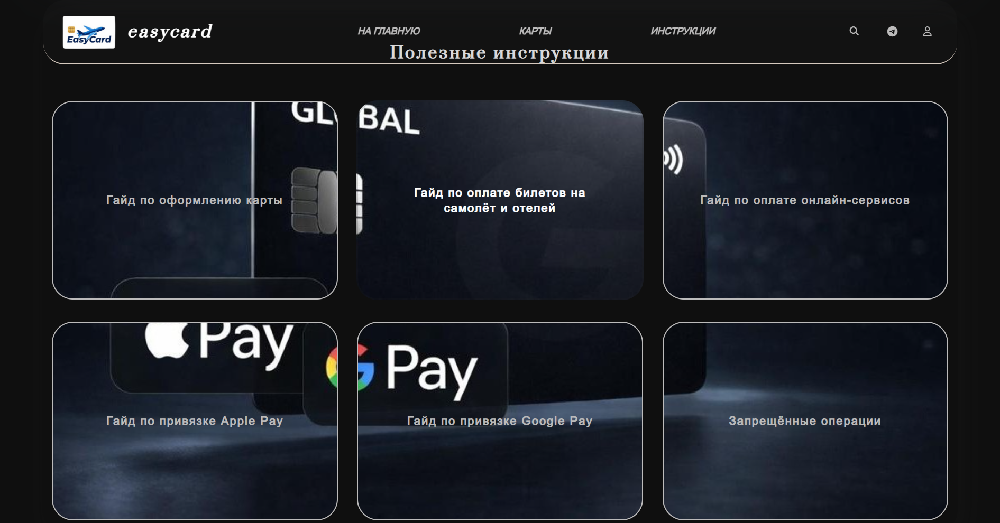

# Это тестовый проект создания сайта-визитки для продуктовой линейки виртуальных карт для покупок заграницей

 

## Структура проекта:
### Сайт представлен главной страницей, включающей основную информацию о продукте (блоки: О нас", "Карты" и "Инструкция") и 2 дополнительных страницы по локальным продуктам со своей спецификой.

Проект основан на html5, css3 и js.

Архитектура проекта построена с использованием препроцессора Sass.

Веб-сайт совместим с различными браузерами (корректно открывается в Google Chrome, Microsoft Edge, Opera и Safari).
Сайт в процессе адаптирования для работы на различных устройствах

#### Десктоп-версия:
## Главная страница:

## Дополнительные страницы схожи по структуре, но имеют разное оформление:

 

